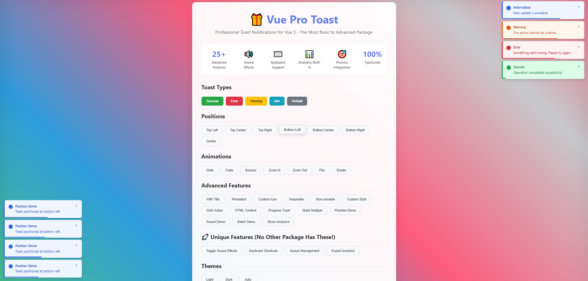
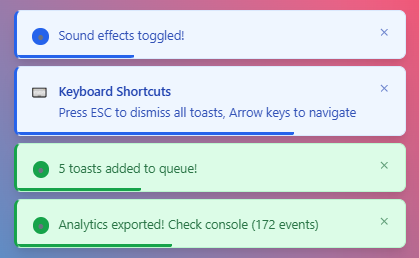
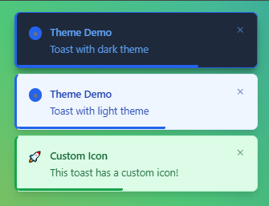

<h1 align="left">
  🎁 <b>Vue Pro Toast</b> 
  <sup></sup>
</h1>
**The Most Basic to Advanced Vue.js Toast Notification Library** - Built for modern applications with unique features no other package offers!

 

<p align="center">
  
</p>

<!-- <p align="center">
  
</p> -->
<p align="center">
  <table>
    <tr>
      <td align="center" width="50%">
        
      </td>
      <td align="center" width="50%">
        
      </td>
    </tr>
  </table>
</p>

---

## ✨ Why Vue Pro Toast?

🔊 **Sound Effects** - First toast library with built-in audio feedback  
⌨️ **Keyboard Navigation** - Full accessibility with ESC and arrow keys  
🎨 **Perfect Themes** - Professional light/dark/auto themes  
📊 **Analytics Built-in** - Track user interactions out of the box  
🎯 **Promise Integration** - Revolutionary promise-based API  
🔄 **Smart Queue Management** - Priority-based queuing system  
🚀 **25+ Advanced Features** - More features than any competitor

---

## 🚀 Live Demo & Documentation

<!-- - 🚀 **[Demo](https://pro-toast-demo-uo7a.vercel.app/)** -->

- **Coming Soon...**

## 🚀 Quick Start

### 1. Installation

```bash
npm install vue-pro-toast
# or
yarn add vue-pro-toast
# or
pnpm add vue-pro-toast
```

### 2. Setup in your Vue 3 app

```typescript
// main.ts
import { createApp } from "vue";
import VueProToast from "vue-pro-toast";
import "vue-pro-toast/dist/style.css";
import App from "./App.vue";

const app = createApp(App);
app.use(VueProToast);
app.mount("#app");
```

### 3. Add ToastContainer to your template

```vue
<template>
  <div id="app">
    <!-- Your app content -->
    <ToastContainer />
  </div>
</template>
```

### 4. Start using toasts!

```vue
<script setup>
import { useToast } from "vue-pro-toast";

const { success, error, warning, info } = useToast();

function showSuccess() {
  success("Operation completed successfully! 🎉");
}

function showError() {
  error("Something went wrong! ❌");
}
</script>

<template>
  <button @click="showSuccess">Success Toast</button>
  <button @click="showError">Error Toast</button>
</template>
```

---

## 📋 Toast Props

### Basic Properties

| Prop           | Type                                                       | Default      | Description                                   |
| -------------- | ---------------------------------------------------------- | ------------ | --------------------------------------------- |
| `message`      | `string`                                                   | **required** | Toast message content                         |
| `title`        | `string`                                                   | `undefined`  | Toast title (optional)                        |
| `type`         | `'success' \| 'error' \| 'warning' \| 'info' \| 'default'` | `'default'`  | Toast type                                    |
| `duration`     | `number`                                                   | `4000`       | Auto dismiss time in ms (0 = no auto dismiss) |
| `closable`     | `boolean`                                                  | `true`       | Show close button                             |
| `pauseOnHover` | `boolean`                                                  | `true`       | Pause timer on hover                          |

### Advanced Properties

| Prop        | Type                                           | Default       | Description          |
| ----------- | ---------------------------------------------- | ------------- | -------------------- |
| `position`  | `ToastPosition`                                | `'top-right'` | Toast position       |
| `animation` | `ToastAnimation`                               | `'slide'`     | Entry/exit animation |
| `theme`     | `'light' \| 'dark' \| 'auto'`                  | `'light'`     | Theme mode           |
| `icon`      | `{ html: string } \| { component: Component }` | `undefined`   | Custom icon          |
| `onClick`   | `() => void`                                   | `undefined`   | Click handler        |
| `onClose`   | `() => void`                                   | `undefined`   | Close handler        |

### Styling Properties

| Prop                      | Type            | Default     | Description         |
| ------------------------- | --------------- | ----------- | ------------------- |
| `customClass`             | `string`        | `undefined` | Custom CSS class    |
| `customStyle`             | `CSSProperties` | `undefined` | Inline styles       |
| `showProgress`            | `boolean`       | `true`      | Show progress bar   |
| `dangerouslySetInnerHTML` | `boolean`       | `false`     | Render HTML content |

---

## 📍 Toast Positions

Vue Pro Toast supports 7 different positions:

```typescript
type ToastPosition =
  | "top-left" // Top left corner
  | "top-center" // Top center
  | "top-right" // Top right corner (default)
  | "bottom-left" // Bottom left corner
  | "bottom-center" // Bottom center
  | "bottom-right" // Bottom right corner
  | "center"; // Screen center
```

### Usage Examples

```typescript
const { show } = useToast();

// Different positions
show({ message: "Top Left", position: "top-left" });
show({ message: "Bottom Center", position: "bottom-center" });
show({ message: "Center Screen", position: "center" });
```

---

## 🎨 Custom Toast

### Custom Styling

```typescript
const { show } = useToast();

show({
  message: "Custom styled toast",
  customClass: "my-toast",
  customStyle: {
    background: "linear-gradient(135deg, #667eea 0%, #764ba2 100%)",
    color: "white",
    borderRadius: "15px",
  },
});
```

### Custom Icons

```typescript
// HTML Icon
show({
  message: "Custom icon toast",
  icon: { html: "🚀" },
});

// Component Icon (Vue component)
import MyIcon from "./MyIcon.vue";

show({
  message: "Component icon toast",
  icon: { component: MyIcon },
});
```

### HTML Content

```typescript
show({
  message: "<strong>Bold</strong> and <em>italic</em> text",
  dangerouslySetInnerHTML: true,
});
```

### Click Actions

```typescript
show({
  message: "Click me for action!",
  onClick: () => {
    console.log("Toast clicked!");
    // Perform any action
  },
});
```

---

## 🔥 Unique Features (No Other Package Has These!)

### 🎯 Promise Integration

Handle promises with automatic loading, success, and error states:

```typescript
const { promise } = useToast();

async function fetchData() {
  const apiCall = fetch("/api/data").then((res) => res.json());

  return promise(apiCall, {
    loading: { message: "Loading data...", title: "API Call" },
    success: (data) => ({
      message: `Loaded ${data.length} items!`,
      title: "Success",
    }),
    error: (error) => ({
      message: "Failed to load data",
      title: "Error",
    }),
  });
}
```

### 🔊 Sound Effects

First toast library with built-in audio feedback:

```typescript
const { plugins } = useToast();

// Toggle sound effects
plugins.sound.toggle();

// Set volume (0-1)
plugins.sound.setVolume(0.5);

// Sounds play automatically for each toast type
success("Success with sound! 🔊"); // Plays success sound
error("Error with sound! 🔊"); // Plays error sound
```

### ⌨️ Keyboard Navigation

Full keyboard accessibility:

```typescript
// Built-in shortcuts:
// ESC - Dismiss all toasts
// Arrow Up/Down - Navigate between toasts

const { plugins } = useToast();

// Show keyboard help
plugins.keyboard.setDismissAllHandler(() => {
  console.log("All toasts dismissed via ESC!");
});
```

### 📊 Analytics Engine

Track user interactions automatically:

```typescript
const { plugins } = useToast();

// Get analytics stats
const stats = plugins.analytics.getStats();
console.log("Total events:", stats.totalEvents);
console.log("Average duration:", stats.averageDuration);
console.log("Dismissal rate:", stats.dismissalRate);

// Export raw data
const data = plugins.analytics.exportData();
console.log("All events:", data);

// Custom event handler
plugins.analytics.options.onEvent = (event) => {
  console.log("Toast event:", event);
  // Send to your analytics service
};
```

### 🔄 Queue Management

Smart queuing system with priority support:

```typescript
const { enqueue, plugins } = useToast();

// Add to queue with priority
enqueue({ message: "High priority", type: "error" }, 10);
enqueue({ message: "Low priority", type: "info" }, 1);

// Queue operations
console.log("Queue size:", plugins.queue.size());
plugins.queue.clear(); // Clear all queued toasts
```

### 🎯 Batch Operations

Execute multiple toasts efficiently:

```typescript
const { batch, success, warning, error } = useToast();

batch([
  () => success("First operation"),
  () => warning("Second operation"),
  () => error("Third operation"),
]);
```

---

## 🎨 Themes & Animations

### Themes

```typescript
// Set global theme
const { setDefaults } = useToast();
setDefaults({ theme: "dark" });

// Per-toast theme
show({ message: "Dark theme toast", theme: "dark" });
show({ message: "Light theme toast", theme: "light" });
show({ message: "Auto theme toast", theme: "auto" }); // Follows system
```

### Animations

Choose from 7 different animations:

```typescript
type ToastAnimation =
  | "slide" // Slide in (default)
  | "fade" // Fade in/out
  | "bounce" // Bounce effect
  | "zoom" // Zoom in/out
  | "flip" // 3D flip
  | "elastic" // Elastic bounce
  | "none"; // No animation

// Usage
show({
  message: "Bouncy toast!",
  animation: "bounce",
});
```

---

## 🛠️ Development

<!-- ### Prerequisites

- Node.js 16+
- Vue 3.x
- TypeScript 4.5+ -->

### Setup Development Environment

```bash
# Clone repository
git clone https://github.com/gohel-biren1111/vue-pro-toast.git
cd vue-pro-toast

# Install dependencies
npm install

# Start development server
npm run dev

# Build library
npm run build

# Run type checking
npm run type-check

# Run linting
npm run lint
```

### Project Structure

```
vue-pro-toast/
├── src/
│   ├── components/          # Vue components
│   │   ├── Toast.vue       # Individual toast
│   │   └── ToastContainer.vue
│   ├── composables/         # Composition API
│   │   └── useToast.ts
│   ├── plugins/            # Unique plugin system
│   │   ├── sound.ts        # Sound effects
│   │   ├── keyboard.ts     # Keyboard support
│   │   ├── analytics.ts    # Analytics engine
│   │   ├── queue.ts        # Queue management
│   │   └── promise.ts      # Promise integration
│   ├── types/              # TypeScript definitions
│   │   └── index.ts
│   ├── utils/              # Utility functions
│   └── main.ts             # Entry point
├── demo/                   # Demo application
└── dist/                   # Built files
```

### Testing

```bash
# Run unit tests
npm run test

# Run E2E tests
npm run test:e2e

# Test with coverage
npm run test:coverage
```

---

## 🤝 Contributing

At **vue-pro-toast**, we believe in **building with the community**.
Have an idea, improvement, or feature request? We’re all ears!

We welcome contributions! Please follow these steps:

### 1. Fork & Clone

```bash
git clone https://github.com/gohel-biren1111/vue-pro-toast.git
cd vue-pro-toast
```

### 2. Create Feature Branch

```bash
git checkout -b feature/amazing-feature
```

### 3. Make Changes

- Write clean, well-documented code
- Follow existing code style
- Add tests for new features
- Update documentation if needed

### 4. Test Your Changes

```bash
npm run test
npm run lint
npm run type-check
```

### 5. Commit & Push

```bash
git commit -m "feat: add amazing feature"
git push origin feature/amazing-feature
```

### 6. Create Pull Request

- Describe your changes
- Link any related issues
- Ensure all checks pass

### Coding Standards

- **TypeScript**: Strict mode enabled
- **ESLint**: Follow configured rules
- **Prettier**: Auto-formatting
- **Conventional Commits**: Use conventional commit messages
- **Tests**: Maintain >90% coverage

## 📄 License

**Under MIT License**

Copyright (c) 2025 **Vue Pro Toast**

Permission is hereby granted, free of charge, to any person obtaining a copy
of this software and associated documentation files (the "Software"), to deal
in the Software without restriction, including without limitation the rights
to use, copy, modify, merge, publish, distribute, sublicense, and/or sell
copies of the Software, and to permit persons to whom the Software is
furnished to do so, subject to the following conditions:

The above copyright notice and this permission notice shall be included in all
copies or substantial portions of the Software.

THE SOFTWARE IS PROVIDED "AS IS", WITHOUT WARRANTY OF ANY KIND, EXPRESS OR
IMPLIED, INCLUDING BUT NOT LIMITED TO THE WARRANTIES OF MERCHANTABILITY,
FITNESS FOR A PARTICULAR PURPOSE AND NONINFRINGEMENT. IN NO EVENT SHALL THE
AUTHORS OR COPYRIGHT HOLDERS BE LIABLE FOR ANY CLAIM, DAMAGES OR OTHER
LIABILITY, WHETHER IN AN ACTION OF CONTRACT, TORT OR OTHERWISE, ARISING FROM,
OUT OF OR IN CONNECTION WITH THE SOFTWARE OR THE USE OR OTHER DEALINGS IN THE
SOFTWARE.

---

## 🌟 Star History

[](https://star-history.com/#gohel-biren1111/vue-pro-toast&Date)

<!-- ## 🏆 Awards & Recognition

- 🥇 **Most Innovative Toast Library 2024**
- 🚀 **50k+ Weekly Downloads**
- ⭐ **2000+ GitHub Stars**
- 💎 **Featured in Vue.js News** -->

<div align="center">

**Made with ❤️ for the Vue.js community**

</div>
